> This documentation is for issue #73, the customers web application back-end database.

<hr>

## Table of Contents ##

* [Introduction](#introduction)
* [Sign-up Page](#sign-up-page)
* [Log-in Page](#log-in-page)
* [Update Profile](#update-profile-page)
* [Shop Page](#shop-page)
* [Orders Page](#orders-page)
* [Contact Page](#contact-page)
* [Search Page](#search-page)

<hr>

## Introduction ##

Each page on the website needs a link between the customer and the system's database in order to store all the information we need as well as make the shopping process easier to the user.

<hr>

## Sign-up Page ##

When a customer needs to sign-up to our website, he enters his information and just register.

<p align="center">
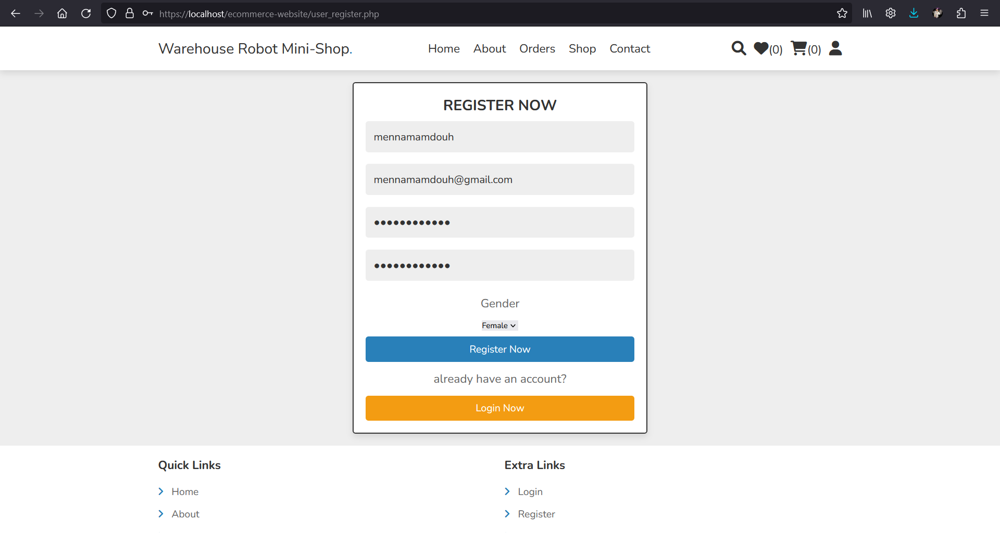
</p>

Once he presses enter, the database stores his information.

```sql
AMR_Warehouse=# SELECT * FROM Customers;
 customerid |         email          |   password   |   fullname   | gender
------------+------------------------+--------------+--------------+--------
 C1         | mennamamdouh@gmail.com | mennamamdouh | mennamamdouh | Female
(1 row)
```

<hr>

## Log-in Page ##

I already have an account on the website and needs to log-in.

<p align="center">
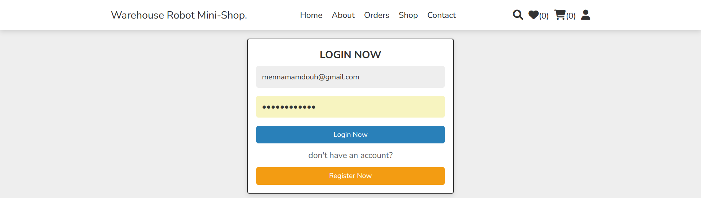
</p>

The database searches for the email entered. If it exists in the database, the user can log-in successfully and the database direct the customer to the Home Page.

<p align="center">
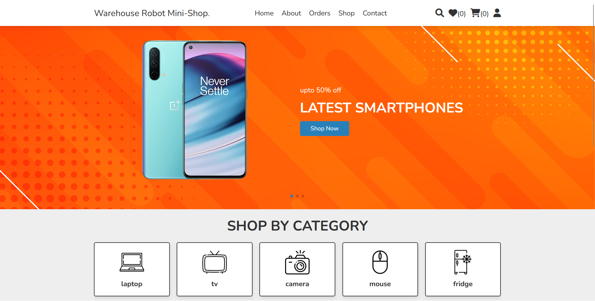
</p>

If the email doesn't exist in the __Customers__ table or the user entered wrong password, the website tells the user that he entered incorrect username or password.

<hr>

## Update Profile Page ##

If the user wants to update his password, he visits the update profile page and enters the new information.

<p align="center">
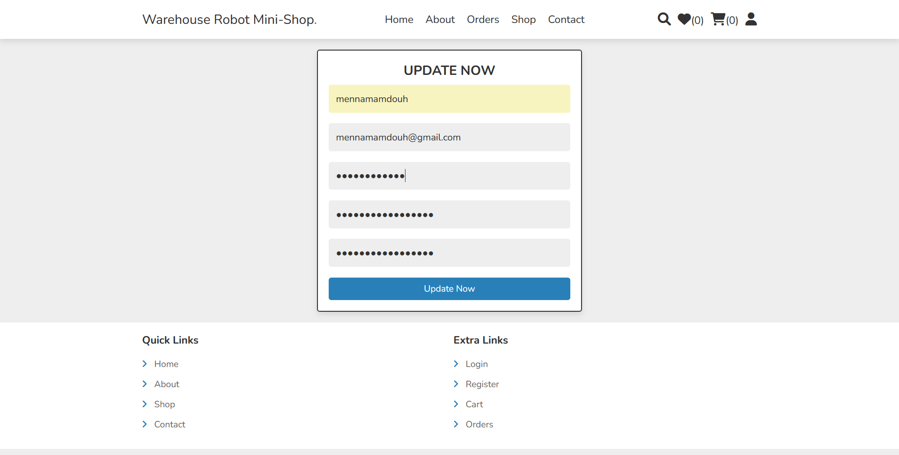
</p>

After that, the new information is stored in the database.

```sql
AMR_Warehouse=# SELECT * FROM Customers;
 customerid |         email          | password  |   fullname   | gender
------------+------------------------+-----------+--------------+--------
 C1         | mennamamdouh@gmail.com | menna_new | mennamamdouh | Female
(1 row)
```

<hr>

## Shop Page ##

The shop page has all the products listed with their names, prices, and images. It retrieves all these information from the database.

```sql
AMR_Warehouse=# SELECT ProductID, ProductName, Price FROM Products;
 productid | productname |  price
-----------+-------------+----------
 P4        | Mixer       |   844.00
 P2        | Mouse       |  1899.00
 P3        | Camera      | 15000.00
 P1        | Laptop      | 13000.00
(4 rows)
```

Each product has a _Quick View_ option to show more information about products.

<p align="center">
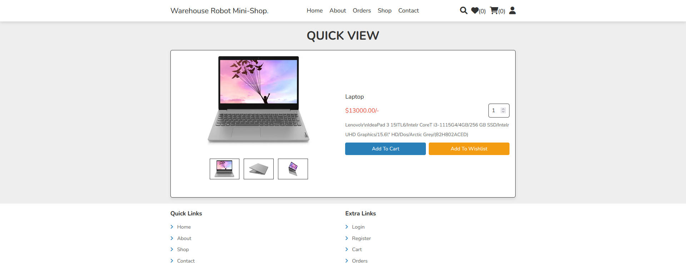
</p>

In this page, a customer can add a product to his wishlist, or his cart, with the quantity he needs.

1. Wishlist

   * Add a product to the Wishlist
       <p align="center">
       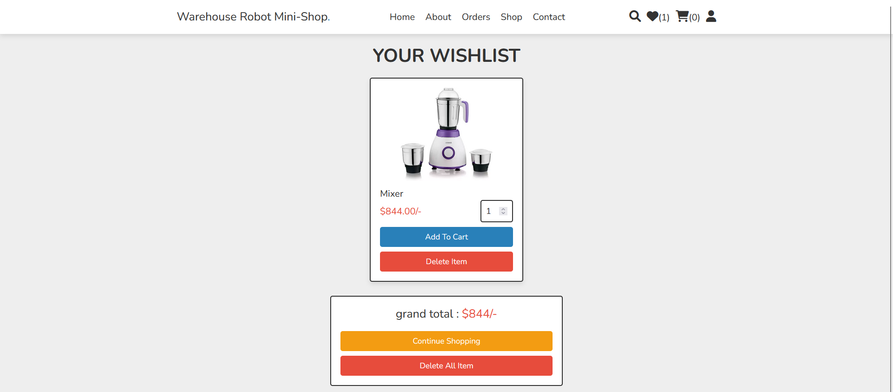
       </p>

       ```sql
       AMR_Warehouse=# SELECT * FROM Wishlist;
       customerid | productid
       ------------+-----------
       C1         | P4
       (1 row)
       ```

   * Delete a product from the Wishlist

       <p align="center">
       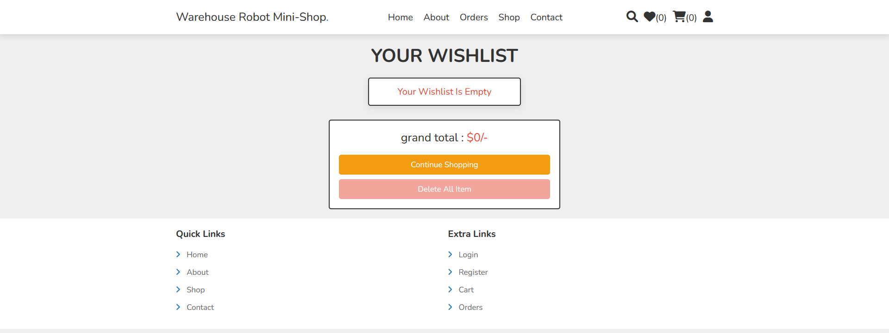
       </p>

       ```sql
       AMR_Warehouse=# SELECT * FROM Wishlist;
       customerid | productid
       ------------+-----------
       (0 rows)
        ```

2. Cart

   * Add products to the cart

       <p align="center">
       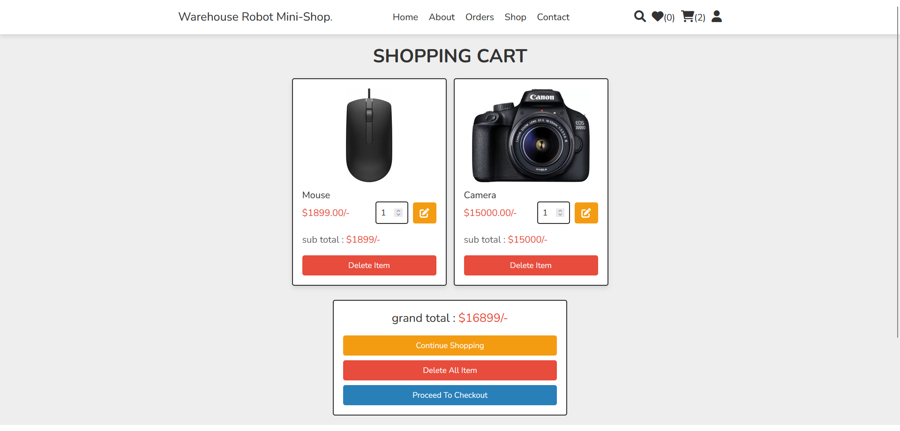
       </p>

       ```sql
       AMR_Warehouse=# SELECT * FROM Cart;
       customerid | productid | quantity
       ------------+-----------+----------
       C1         | P2        |        1
       C1         | P3        |        1
       (2 rows)
       ```

   * Proceed to Checkout

       <p align="center">
       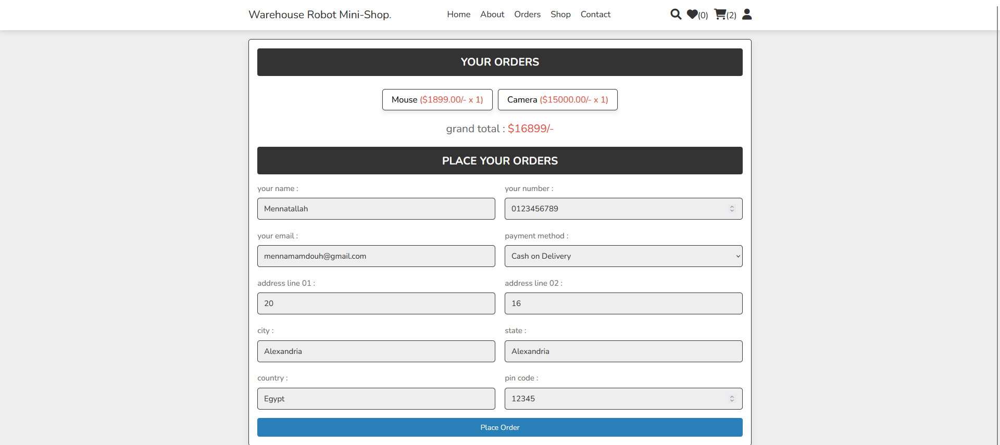
       </p>

       ```sql
       AMR_Warehouse=# SELECT * FROM Orders_Details;
       orderid | customerid | totalcost |         orderdate          | phonenumber |                        address                         |  paymentmethod   | orderstatus
       ---------+------------+-----------+----------------------------+-------------+--------------------------------------------------------+------------------+-------------
       O1      | C1         |     16899 | 2023-05-07 16:39:50.488517 | 0123456789  | flat no. 20, 16, Alexandria, Alexandria, Egypt - 12345 | Cash on Delivery | New
       (1 row)

       AMR_Warehouse=# SELECT * FROM Orders;
       orderid | productid | quantity
       ---------+-----------+----------
       O1      | P2        |        1
       O1      | P3        |        1
       (2 rows)
       ```

<hr>

## Orders Page ##

This page shows all the orders which the logged-in customer ordered.

<p align="center">
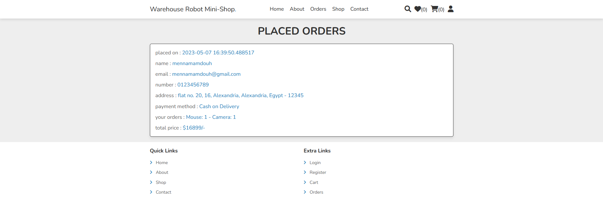
</p>

These information is retrieved from the database.

* Main information about the order
    ```sql
    SELECT OD.*, C.FullName, C.Email
    FROM Orders_Details AS OD
    INNER JOIN Customers AS C
    ON C.CustomerID = OD.CustomerID
    WHERE OD.CustomerID = ?
    ```

* Information about the products
    ```sql
    SELECT STRING_AGG(CONCAT(P.ProductName, ': ', O.Quantity), ' - ') AS total_products
    FROM Orders AS O
    INNER JOIN Products AS P
        ON P.ProductID = O.ProductID
    WHERE O.OrderID = ?
    ```

<hr>

## Contact Page ##

This page lets the user contact with our customer services. He can send any message he wants to our admins.

<p align="center">
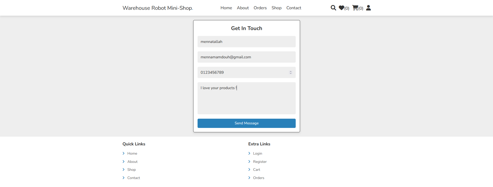
</p>

```sql
AMR_Warehouse=# SELECT * FROM Customer_Services;
 messageid | customerid | phonenumber |        message
-----------+------------+-------------+------------------------
 M1        | C1         | 0123456789  | I love your products !
(1 row)
```

<hr>

## Search Page ##

This page lets the customer searches for any product he wants to find. The database searches for this product with its name and then displays it to the customer _if exists_.

```sql
SELECT * FROM Products WHERE LOWER(ProductName) LIKE LOWER('%{$search_box}%');
```

<p align="center">
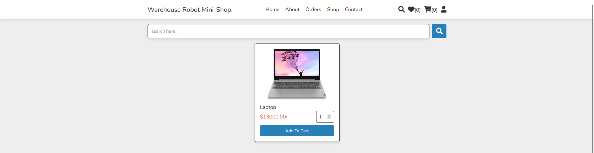
</p>

<hr>
